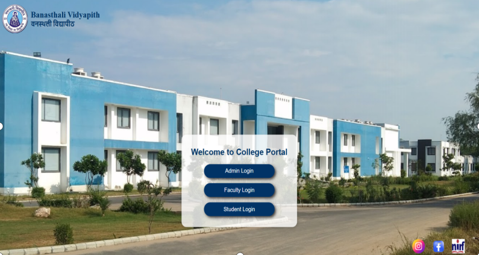
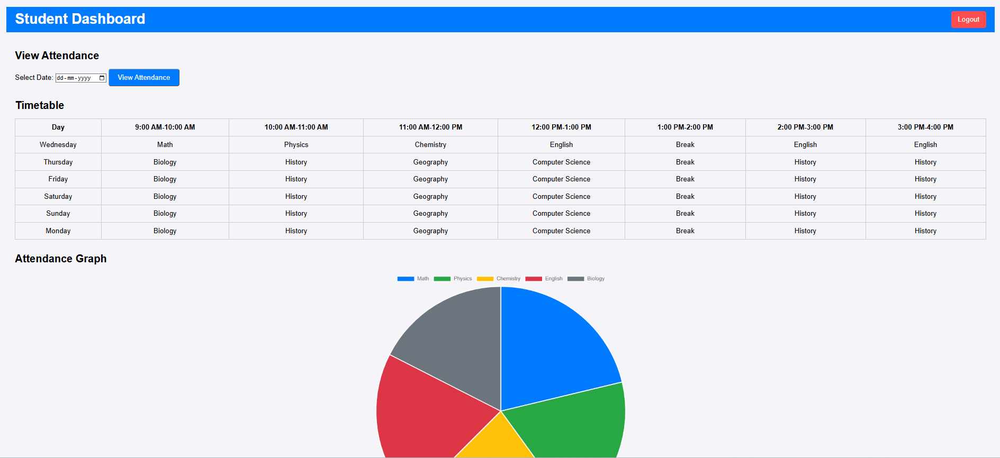
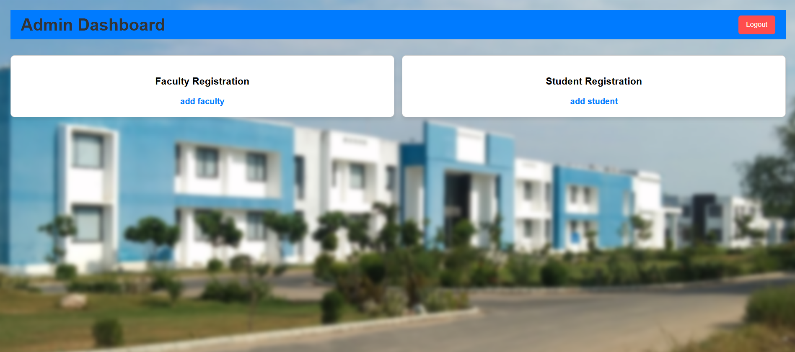

# AI-Based Face Recognition Attendance System

An AI-based attendance management system that automates student attendance using facial recognition. The system provides a web-based interface for student and faculty management, face-based attendance marking, attendance monitoring, and report generation.

---

## 📌 Overview

The **AI-Based Face Recognition Attendance System** is designed to reduce the effort and time involved in traditional manual attendance.

The system allows students to be registered along with their facial images. During attendance, the application uses a camera to detect and recognize registered students. Once a student is identified, the system records the attendance and makes the information available through the application's dashboards and reports.

The project combines:

- Web-based frontend interfaces
- Node.js server-side functionality
- Python-based face recognition
- OpenCV-based image processing
- Attendance management
- Excel-based attendance records and reports

The project was developed as a practical application of **Artificial Intelligence, Computer Vision, Web Development, and Automation**.

---

## ✨ Features

### 👨‍🎓 Student Management

- Student registration
- Student information management
- Facial image registration
- Student dashboard

### 👨‍🏫 Faculty & Administration

- Faculty registration
- Admin dashboard
- Student management
- Attendance monitoring

### 🤖 Face Recognition

- Camera-based face detection
- Recognition of registered students
- Automated student identification
- Face-based attendance marking

### 📊 Attendance Management

- Automated attendance recording
- Attendance monitoring
- Student attendance information
- Attendance report generation

### 📁 Reports

- Excel-based attendance records
- Structured attendance data
- Easy access to attendance reports

### 🖥️ Web Interface

- Home page
- Student registration interface
- Faculty registration interface
- Admin dashboard
- Student dashboard
- Attendance interface
- Attendance report interface

---

## 🛠 Technologies Used

| Category | Technologies |
|---|---|
| Programming Languages | Python, JavaScript |
| Frontend | HTML5, CSS3, JavaScript |
| Backend | Node.js, Python |
| Computer Vision | OpenCV, face_recognition |
| Data & Reports | Excel, openpyxl |
| Package Management | npm, pip |
| Version Control | Git, GitHub |
| Development Environment | VS Code |

---

## 🏗️ System Architecture

The system consists of a web frontend, backend components, a Python-based face recognition module, attendance management logic, and file-based storage.

### High-Level Architecture

```text
                         ┌───────────────────────┐
                         │         USER          │
                         │                       │
                         │ Admin / Faculty /     │
                         │ Student               │
                         └───────────┬───────────┘
                                     │
                                     ▼
                         ┌───────────────────────┐
                         │     WEB FRONTEND      │
                         │                       │
                         │ HTML / CSS / JS       │
                         │                       │
                         │ • Registration        │
                         │ • Attendance          │
                         │ • Dashboard           │
                         │ • Reports             │
                         └───────────┬───────────┘
                                     │
                         ┌───────────┴───────────┐
                         │                       │
                         ▼                       ▼
                ┌──────────────────┐    ┌────────────────────┐
                │    NODE.JS       │    │   PYTHON BACKEND   │
                │    SERVER        │    │                    │
                │                  │    │      app.py        │
                │    server.js     │    │                    │
                │                  │    │ Application Logic   │
                └─────────┬────────┘    └─────────┬──────────┘
                          │                       │
                          │                       ▼
                          │             ┌────────────────────┐
                          │             │  FACE RECOGNITION  │
                          │             │                    │
                          │             │   face_recog.py    │
                          │             │                    │
                          │             │ OpenCV +           │
                          │             │ face_recognition   │
                          │             └─────────┬──────────┘
                          │                       │
                          │                       ▼
                          │             ┌────────────────────┐
                          │             │ ATTENDANCE MANAGER │
                          │             │                    │
                          │             │ attendance_manager │
                          │             └─────────┬──────────┘
                          │                       │
                          └───────────┬───────────┘
                                      │
                                      ▼
                           ┌─────────────────────┐
                           │   DATA & REPORTS    │
                           │                     │
                           │ • Face Images       │
                           │ • Attendance Data   │
                           │ • Excel Reports     │
                           │ • Uploaded Images   │
                           └─────────────────────┘
## 🔄 System Workflow

The overall attendance workflow can be represented as:

                 Student Registration
                         │
                         ▼
                 Capture Face Images
                         │
                         ▼
                 Store Student Data
                         │
                         ▼
                  Start Attendance
                         │
                         ▼
                 Camera Captures Face
                         │
                         ▼
                   Face Detection
                         │
                         ▼
                  Face Recognition
                         │
                    ┌────┴────┐
                    │         │
                  Match     No Match
                    │         │
                    ▼         ▼
              Identify      Continue
               Student      Detection
                    │
                    ▼
             Mark Attendance
                    │
                    ▼
             Store Attendance
                    │
                    ▼
           Dashboard / Excel Report

## 🔍 How Face Recognition Works

The attendance process follows these basic stages:

1. Student Registration

The administrator or authorized user registers a student through the registration interface.

The student's information and facial images are provided to the system.

2. Face Data Preparation

The registered images act as reference data for identifying the student during attendance.

3. Camera Input

During attendance, the system accesses the camera and captures frames containing student faces.

4. Face Detection

The system processes the camera frames to locate faces.

5. Face Recognition

The detected face is compared against the registered facial data to identify the corresponding student.

6. Attendance Marking

When a registered student is recognized, the attendance management component records the student's attendance.

7. Attendance Reporting

The attendance information can then be accessed through the application's interfaces and generated reports.

## ⚙️ Installation
Prerequisites

Before running the project, make sure the following are installed:

Python 3.x
Node.js
npm
Git
A working camera/webcam for face recognition

## 1. Clone the Repository
git clone https://github.com/aishh-01/AI-based-face-recognition-attendance-system.git
## 2. Navigate to the Project
cd AI-based-face-recognition-attendance-system
## 3. Install Node.js Dependencies

Run:

npm install

This installs the dependencies specified in package.json.

## 4. Install Python Dependencies

Run:

pip install -r requirements.txt

This installs the Python packages required by the project.

## 🚀 How to Run

The project contains both Node.js and Python components.

Start the Node.js Server

Run:

node server.js
Start the Python Application

Run:

python server/app.py

Once the required services are running, open the application using the local address configured by the project.

The exact startup sequence and port may depend on the local environment and project configuration.

## 📸 Screenshots

### 🏠 Home Page



### 👨‍💼 Faculty Dashboard


### 👨‍🎓 Student Registration



### 👨‍💼 Admin Dashboard



### 📷 Face Recognition & Attendance


### 📊 Attendance Report

